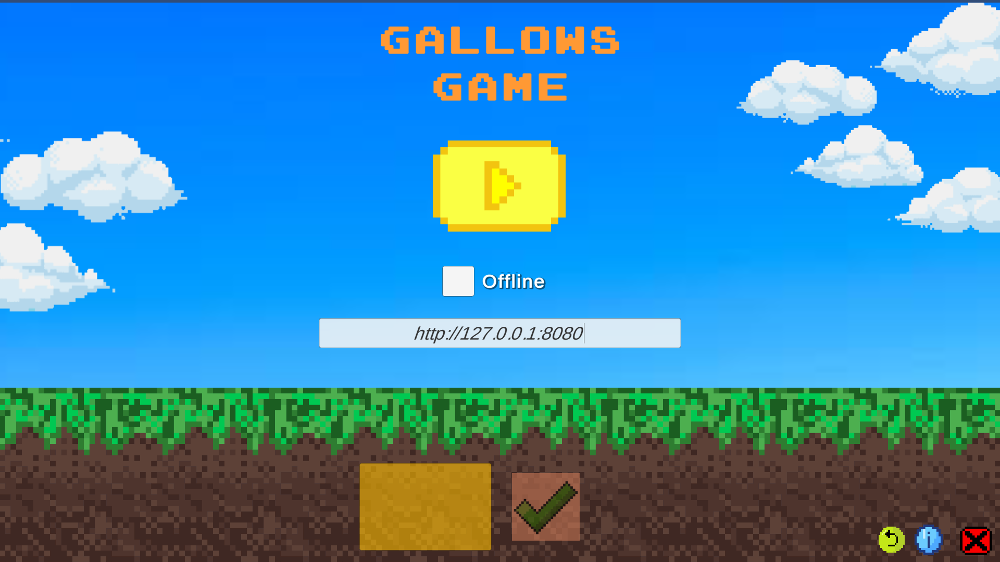
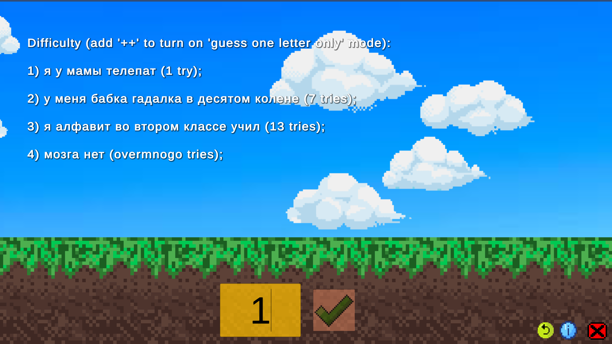
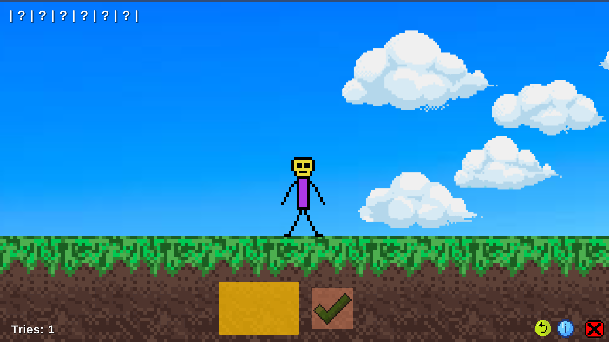
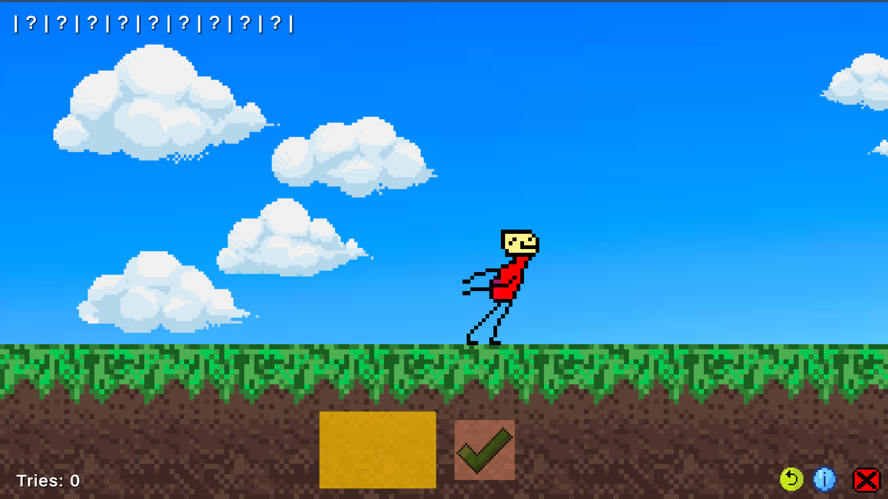

# GallowsGame

  

**GallowsGame (Hangman)** is a 2D sprite game with:

+ 4 difficulty levels;
+ [offline](./Assets/Scripts/Gameplay/Offline/OfflineStrategy.cs) mode;
+ online mode, 4 clients (using **[gallows-remastered API](https://github.com/Andrew1407/gallows-remastered)**):
  + [HTTP](./Assets/Scripts/Gameplay/Online/HttpClientStrategy.cs).
  + [WebSocket](./Assets/Scripts/Gameplay/Online/WebSocketClientStrategy.cs).
  + [UDP](./Assets/Scripts/Gameplay/Online/UdpClientStrategy.cs).
  + [TCP](./Assets/Scripts/Gameplay/Online/TcpClientStrategy.cs).

## Gameplay

Play offline:

Play online:

Choose difficulty:

Main gameplay (wordguessing):

Loss cases:

Win case (guess a word):

