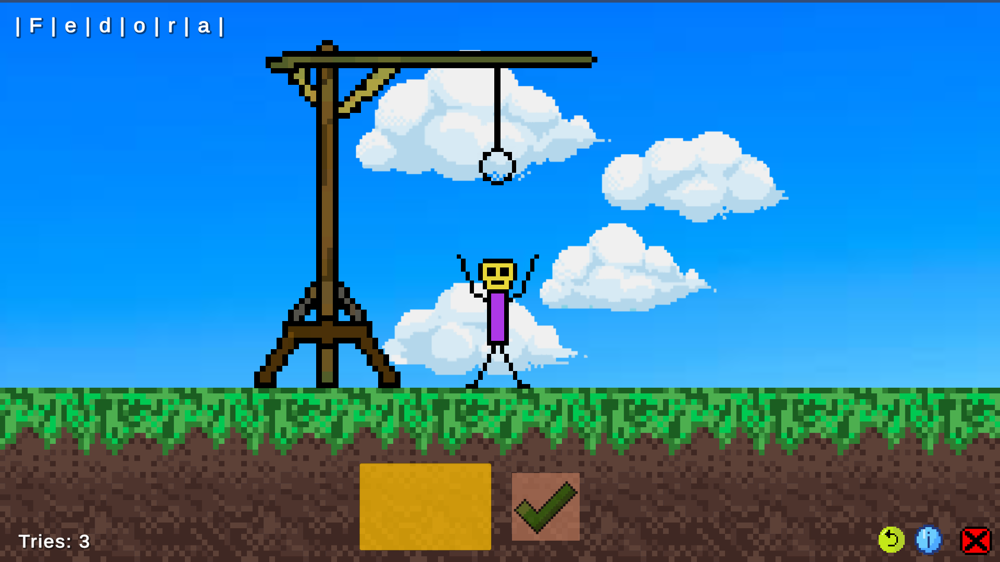

# GallowsGame

**GallowsGame (Hangman)** is a 2D sprite game with:

+ 4 difficulty levels;
+ [offline](./Assets/Scripts/Gameplay/Offline/OfflineStrategy.cs) mode;
+ online mode, clients:
    1. [HTTP](./Assets/Scripts/Gameplay/Online/HttpClientStrategy.cs);
    2. [WebSocket](./Assets/Scripts/Gameplay/Online/WebSocketClientStrategy.cs);
    3. [UDP](./Assets/Scripts/Gameplay/Online/UdpClientStrategy.cs);
    4. [TCP](./Assets/Scripts/Gameplay/Online/TcpClientStrategy.cs);

## Gameplay

Play offline:

Play online:

Choose difficulty:

Main gameplay (wordguessing):

Loss cases:

Win case (guess a word):

